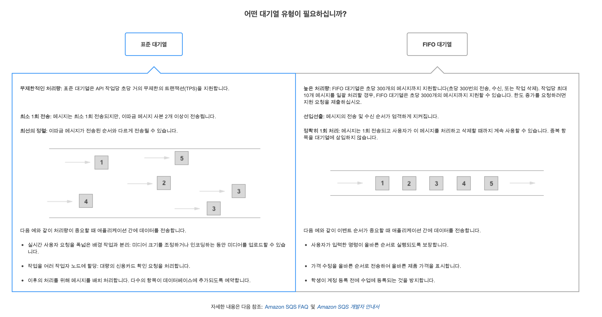
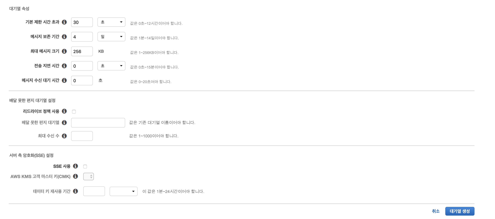

# AWS Lambda & SQS를 사용하여 작업 대기열 구현하기

 

* **기록하고 복습하기 위한 문서입니다.**

* **TaskQueue, AWS Lambda, AWS SQS 위주로 작성했습니다.**

 

## :book: 작업 대기열 (Task Queue)

* 수행되어야 할 작업을 대기열에 저장하고, 실행하는 구조로 이루어져 있습니다.

* 큐에 저장된 작업이 실행되면 다음과 같은 과정을 거칩니다.

    * 컴퓨터 리소스가 허용되면 작업을 실행합니다.

    * 오류가 없으면 작업은 큐에서 제거됩니다.

    * 오류가 발생하면 작업은 큐에서 계속 유지되고, 성공적으로 실행될 때까지 재시도됩니다.

* 작업 대기열을 만들기 위해서는 컴퓨팅 리소스와 큐가 필요합니다.

    * AWS에서는 컴퓨팅 환경을 위해 `Lambda` 서비스를 제공하고, 서비스 간의 메시지 전송을 위한 큐로는 `SQS` 서비스를 제공합니다.

 

## :book: AWS Lambda

* `Lambda`는 서버를 [프로비저닝](https://ko.wikipedia.org/wiki/%ED%94%84%EB%A1%9C%EB%B9%84%EC%A0%80%EB%8B%9D)하거나 관리하지 않고도 코드를 실행할 수 있게 해주는 컴퓨팅 서비스입니다. 

* `Lambda`는 필요시에만 코드를 실행하며, 몇 개의 요청에서 초당 수천 개의 요청까지 자동으로 확장(Auto-Scaling)이 가능합니다.

* `Lambda`는 애플리케이션이나 백엔드 서비스에 대한 코드를 별도의 관리 없이 실행할 수 있습니다.

 

## :book: AWS SQS (Simple Queue Service)

* `SQS`는 높은 확장성과 신뢰성, 지속성이 우수한 보안 호스팅 대기열을 제공합니다.

* 분산 소프트웨어 시스템과 구성 요소를 통합 및 분리할 수 있습니다.

* `SQS`는 표준 대기열과 FIFO 대기열을 제공합니다.

* **표준 대기열**

    * API 작업별로 거의 무제한의 초당 트랜잭션(TPS) 수를 지원합니다.

    * 최소 1회의 메시지 전송을 지원합니다. 그렇지만 고도로 분산된 아키텍쳐는 거의 무제한 처리량을 지원하기 때문에 2개 이상의 메시지 사본이 순서가 맞지 않게 전송될 수 있습니다. 

    * 최선의 순서를 제공하여 메시지가 일반적으로 전송된 순서와 동일한 순서로 전달되도록 합니다.

    * 다음 예와 같이 처리량이 중요할 때 애플리케이션 간에 데이터를 전송합니다.

        * 실시간 사용자 요청을 폭 넓은 배경 

* **FIFO 대기열**

    * 이벤트 순서가 중요하거나 중복 항목이 허용되지 않는 경우에 애플리케이션 간 메시징을 강화해줍니다.

    * 정확히 1회의 메시지 처리를 제공하지만, 초당 트랜잭션(TPS) 수가 제한적입니다.

        * 일괄 처리(Batch Processing)을 통해 API 작업별로 초당 최대 3,000개의 메시지를 지원합니다.

        * 일괄 처리(Batch Processing)없이 API 작업은 초당 최대 300개의 메시지를 지원합니다. 

 

## :book: Service 구조

* 간단 프로세스 요약

    1. 여러 Task가 있습니다. Task들은 `SQS`에 Message를 보냅니다.

    2. `Lambda(Consumer)`는 `SQS`에서 Message를 읽습니다.

    3. 읽어 들인 Message를 처리할 `Lambda(Worker)`를 실행시킵니다.

* `SQS`에서 바로 `Lambda`를 바로 실행시킬 수 없습니다. `SQS`는 메시지의 저장 및 전달만 수행하기 때문입니다.

* `CloudWatch`를 이용하여 Queue를 주기적으로 확인할 수 있는 `Lambda(Consumer)` 함수를 실행시킵니다.

* 실행된 `Lambda(Consumer)`는 Queue에서 Message를 확인하고, 작업을 수행하는 `Lambda(Worker)`를 실행시킵니다. 

 

## :book: SQS 설정하기

* 저는 `표준 대기열` 유형을 선택해 진행했습니다.

* **기본 제한 시간 초과 (DefaultVisibleTimeout)**

    * `SQS`에서 메시지는 특정 Consumer(Component)에 전달된 뒤, 자동으로 삭제되지 않습니다.

    * 다른 Consumer(Component)에서 중복된 메시지를 전달받을 수 있는 문제가 있기 때문에 설정된 일정 시간 동안은 다시 전달되지 않기 위함입니다. (`표준 대기열`이기 때문에 중복되는 메시지를 따로 처리해줘야 합니다.)

* **메시지 보존 기간 (MessageRetentionPeriod)**

    * 메시지의 생명주기입니다. 1분부터 최대 14일까지 지정할 수 있습니다.

* **최대 메시지 크기 (Maximum Message Size)**

    * 메시지의 최대 크기입니다. 최대 256Kbytes까지 사용 가능합니다.

* **전송 지연 시간 (Delivery Delay)**

    * 새로운 메시지가 전달되는 초기 지연 시간입니다.

* **메시지 수신 대기 시간(Receive Message Wait Time)**

    * ReceiveMessage에서 Long Polling을 활성화할 수 있다고 합니다.

    * Long Polling은 ReceiveMessage가 호출되었을 때, 메시지가 없으면 일정 시간 동안 메시지가 도착할 때까지 기다린 후, 새로운 메시지가 도착하면 바로 메시지를 반환합니다. 메시지가 없을 때의 Empty Response에 대한 비용을 절약할 수 있습니다.

    * `SQS`는 기본적으로 Short Polling으로 설정됩니다.

* 배달하지 못한 편지 대기열 설정 (Dead Letter Queue Settings)

    * 메시지가 성공적으로 처리 되지 못하는 조건을 설정하고, 처리 되지 못한 메시지들을 따로 처리할 수 있도록 도와줍니다.

    * 배달하지 못한 대기열은 기존 대기열의 이름과 같아야 하며, 동일한 Region에 있어야 합니다.

 

## :bookmark: 참고

* [Amazon Lambda](https://docs.aws.amazon.com/ko_kr/lambda/latest/dg/welcome.html)

* [Amazon SQS(Simple Queue Service)](https://docs.aws.amazon.com/ko_kr/AWSSimpleQueueService/latest/SQSDeveloperGuide/welcome.html)

* [ZIGZAG 기술 블로그 - SQS, Lambda를 이용한 작업 대기열 만들기](https://devblog.croquis.com/ko/2017-05-13-1-aws-serverless-1/)